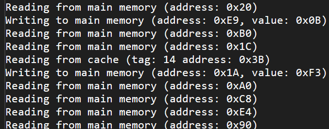
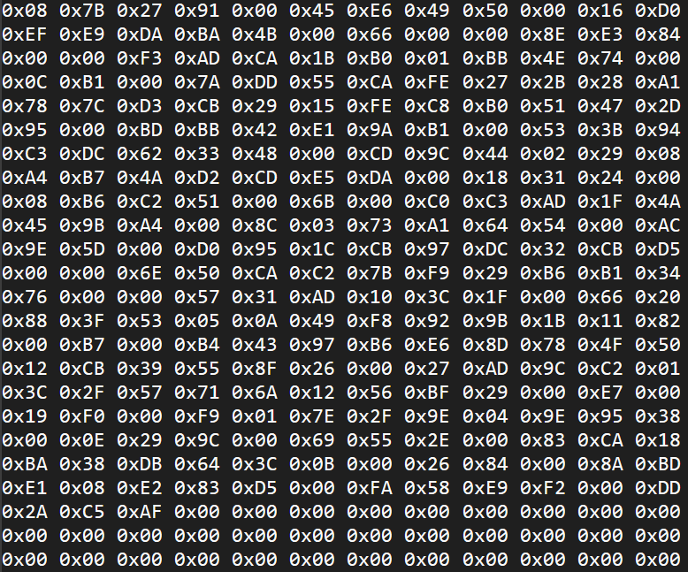
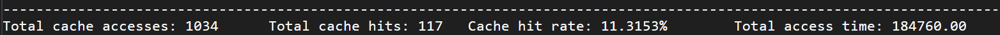

<h1 align="center">🧠 Cache Simulator</h1>

<p align="center">
  
  
</p>

<br>

<div align="center">
  
  
  
</div>

---

## 📖 About

A C++ simulator of a fully associative CPU cache.
It reads memory instructions from a file and prints:

- cache accesses
- cache hits
- cache hit rate
- total cache access time

## 🔨 Build

```bash
cd cache-simulator
g++ -std=c++17 -o main main.cpp MemorySystem.cpp Cache.cpp MainMemory.cpp Processor.cpp ReplacementAlgorithms.cpp MemoryConfig.cpp WriteStrategy.cpp
```

## ▶️ Run

```bash
./main 4 8 8 90 100 LRU WB WR test2.csim
```

Without parameters it uses the defaults: `4 8 8 90 100 LRU WB WR test2.csim` (same as the example).

Parameters (in this order):
- line size - bytes in one cache line (4)
- line count - number of lines in the cache (8)
- address bits - memory address size (8)
- cache time - cache access time in ns (90)
- memory time - memory access time in ns (100)
- replacement - LRU, FIFO or Random
- write hit - WT or WB
- write miss - WR or WA
- file - instruction file (test1.csim or test2.csim)

## 📄 Instruction file

```
B(F5)       read address 0xF5
P(67, 54)   write 0x54 to address 0x67
```

`B` = read, `P` = write (from Slovene *branje* / *pisanje*).

## 📖 Terms

- **Fully associative**: a block can go into any cache line.
- **LRU**: replace the least recently used line.
- **FIFO**: replace the line loaded first.
- **Random**: replace a random line.
- **WT** (write-through): write to cache and memory.
- **WB** (write-back): write to cache only, memory is updated when the line is replaced.
- **WR** (write-around): on a miss, write to memory only.
- **WA** (write-allocate): on a miss, load the block into the cache, then write.

## 📊 Experiments

- [test1-results.md](test1-results.md): read tests (LRU, FIFO, Random)
- [test2-results.md](test2-results.md): write tests (WT, WB, WR, WA)
